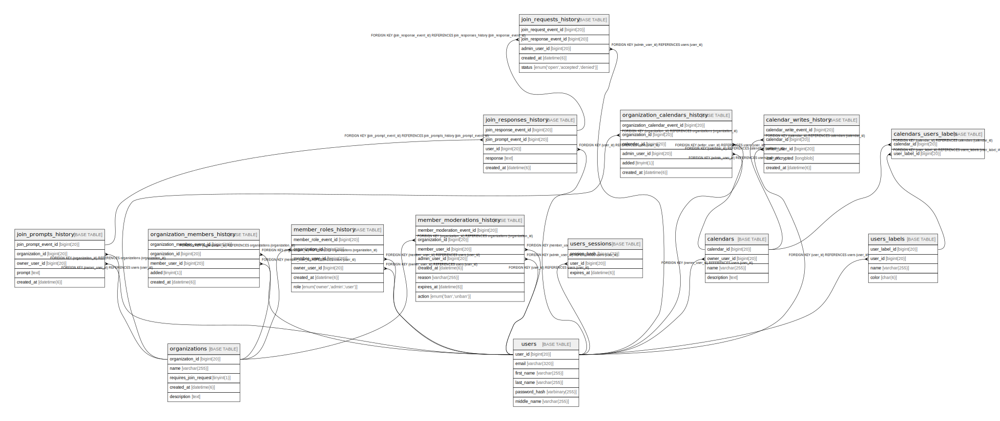

# s25101270_countmein

## Tables

| Name | Columns | Comment | Type |
| ---- | ------- | ------- | ---- |
| [calendars_users_labels](calendars_users_labels.md) | 2 |  | BASE TABLE |
| [member_moderations_history](member_moderations_history.md) | 8 |  | BASE TABLE |
| [organization_members_history](organization_members_history.md) | 5 |  | BASE TABLE |
| [users](users.md) | 6 |  | BASE TABLE |
| [join_responses_history](join_responses_history.md) | 5 |  | BASE TABLE |
| [calendars](calendars.md) | 4 |  | BASE TABLE |
| [join_prompts_history](join_prompts_history.md) | 5 |  | BASE TABLE |
| [join_requests_history](join_requests_history.md) | 5 |  | BASE TABLE |
| [users_labels](users_labels.md) | 4 |  | BASE TABLE |
| [organization_calendars_history](organization_calendars_history.md) | 6 |  | BASE TABLE |
| [users_sessions](users_sessions.md) | 3 |  | BASE TABLE |
| [member_roles_history](member_roles_history.md) | 6 |  | BASE TABLE |
| [calendar_writes_history](calendar_writes_history.md) | 5 |  | BASE TABLE |
| [organizations](organizations.md) | 5 |  | BASE TABLE |

## Stored procedures and functions

| Name | ReturnType | Arguments | Type |
| ---- | ------- | ------- | ---- |
| create_calendar |  | p_actor_user_id bigint; p_name varchar; p_ical longblob; p_description text; p_AES_SECRET_KEY binary; out_calendar_id bigint | PROCEDURE |
| SSELECT |  | p_table varchar; p_database varchar; p_where varchar | PROCEDURE |

## Relations

---

> Generated by [tbls](https://github.com/k1LoW/tbls)
