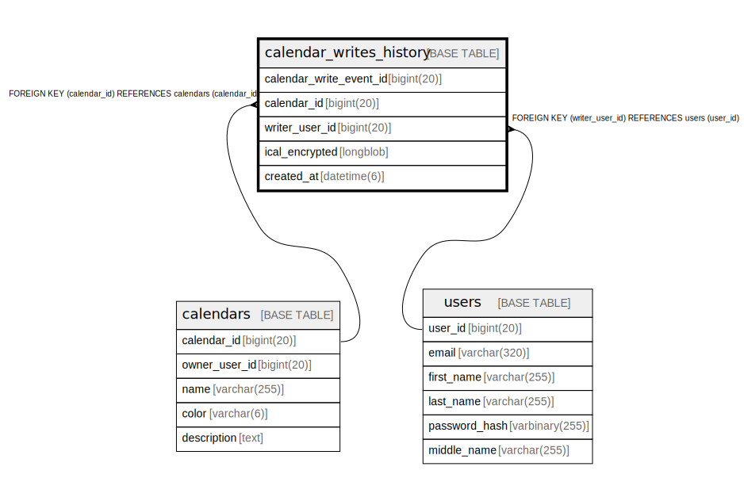

# calendar_writes_history

## Description

<details>
<summary><strong>Table Definition</strong></summary>

```sql
CREATE TABLE `calendar_writes_history` (
  `calendar_write_event_id` bigint(20) NOT NULL AUTO_INCREMENT,
  `calendar_id` bigint(20) NOT NULL,
  `writer_user_id` bigint(20) DEFAULT NULL,
  `ical_encrypted` longblob NOT NULL,
  `created_at` datetime(6) NOT NULL,
  PRIMARY KEY (`calendar_write_event_id`),
  KEY `fk_calendar_writes_history_calendar_id` (`calendar_id`),
  KEY `fk_calendar_writes_history_writer_user_id` (`writer_user_id`),
  CONSTRAINT `fk_calendar_writes_history_calendar_id` FOREIGN KEY (`calendar_id`) REFERENCES `calendars` (`calendar_id`) ON DELETE CASCADE,
  CONSTRAINT `fk_calendar_writes_history_writer_user_id` FOREIGN KEY (`writer_user_id`) REFERENCES `users` (`user_id`) ON DELETE SET NULL
) ENGINE=InnoDB AUTO_INCREMENT=[Redacted by tbls] DEFAULT CHARSET=utf8mb4 COLLATE=utf8mb4_unicode_ci
```

</details>

## Columns

| Name | Type | Default | Nullable | Extra Definition | Children | Parents | Comment |
| ---- | ---- | ------- | -------- | ---------------- | -------- | ------- | ------- |
| calendar_write_event_id | bigint(20) |  | false | auto_increment |  |  |  |
| calendar_id | bigint(20) |  | false |  |  | [calendars](calendars.md) |  |
| writer_user_id | bigint(20) | NULL | true |  |  | [users](users.md) |  |
| ical_encrypted | longblob |  | false |  |  |  |  |
| created_at | datetime(6) |  | false |  |  |  |  |

## Constraints

| Name | Type | Definition |
| ---- | ---- | ---------- |
| fk_calendar_writes_history_calendar_id | FOREIGN KEY | FOREIGN KEY (calendar_id) REFERENCES calendars (calendar_id) |
| fk_calendar_writes_history_writer_user_id | FOREIGN KEY | FOREIGN KEY (writer_user_id) REFERENCES users (user_id) |
| PRIMARY | PRIMARY KEY | PRIMARY KEY (calendar_write_event_id) |

## Indexes

| Name | Definition |
| ---- | ---------- |
| fk_calendar_writes_history_calendar_id | KEY fk_calendar_writes_history_calendar_id (calendar_id) USING BTREE |
| fk_calendar_writes_history_writer_user_id | KEY fk_calendar_writes_history_writer_user_id (writer_user_id) USING BTREE |
| PRIMARY | PRIMARY KEY (calendar_write_event_id) USING BTREE |

## Relations



---

> Generated by [tbls](https://github.com/k1LoW/tbls)
