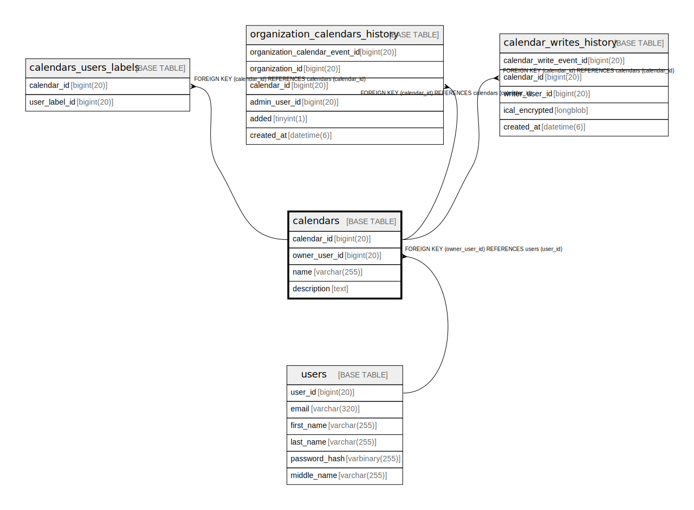

# calendars

## Description

<details>
<summary><strong>Table Definition</strong></summary>

```sql
CREATE TABLE `calendars` (
  `calendar_id` bigint(20) NOT NULL AUTO_INCREMENT,
  `owner_user_id` bigint(20) NOT NULL,
  `name` varchar(255) NOT NULL,
  `description` text DEFAULT NULL,
  PRIMARY KEY (`calendar_id`),
  KEY `fk_calendars_owner_user_id` (`owner_user_id`),
  CONSTRAINT `fk_calendars_owner_user_id` FOREIGN KEY (`owner_user_id`) REFERENCES `users` (`user_id`) ON DELETE CASCADE
) ENGINE=InnoDB AUTO_INCREMENT=[Redacted by tbls] DEFAULT CHARSET=utf8mb4 COLLATE=utf8mb4_unicode_ci
```

</details>

## Columns

| Name | Type | Default | Nullable | Extra Definition | Children | Parents | Comment |
| ---- | ---- | ------- | -------- | ---------------- | -------- | ------- | ------- |
| calendar_id | bigint(20) |  | false | auto_increment | [calendars_users_labels](calendars_users_labels.md) [organization_calendars_history](organization_calendars_history.md) [calendar_writes_history](calendar_writes_history.md) |  |  |
| owner_user_id | bigint(20) |  | false |  |  | [users](users.md) |  |
| name | varchar(255) |  | false |  |  |  |  |
| description | text | NULL | true |  |  |  |  |

## Constraints

| Name | Type | Definition |
| ---- | ---- | ---------- |
| fk_calendars_owner_user_id | FOREIGN KEY | FOREIGN KEY (owner_user_id) REFERENCES users (user_id) |
| PRIMARY | PRIMARY KEY | PRIMARY KEY (calendar_id) |

## Indexes

| Name | Definition |
| ---- | ---------- |
| fk_calendars_owner_user_id | KEY fk_calendars_owner_user_id (owner_user_id) USING BTREE |
| PRIMARY | PRIMARY KEY (calendar_id) USING BTREE |

## Relations



---

> Generated by [tbls](https://github.com/k1LoW/tbls)
