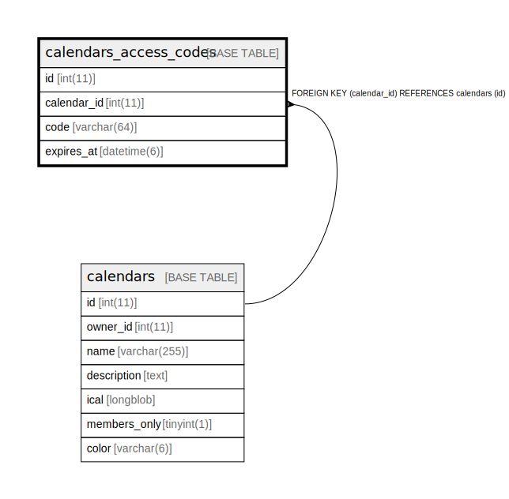

# calendars_access_codes

## Description

<details>
<summary><strong>Table Definition</strong></summary>

```sql
CREATE TABLE `calendars_access_codes` (
  `id` int(11) NOT NULL AUTO_INCREMENT,
  `calendar_id` int(11) NOT NULL,
  `code` varchar(64) NOT NULL,
  `expires_at` datetime(6) DEFAULT NULL,
  PRIMARY KEY (`id`),
  UNIQUE KEY `uq_calendars_access_codes_code` (`code`),
  KEY `fk_calendars_access_codes_calendar_id` (`calendar_id`),
  CONSTRAINT `fk_calendars_access_codes_calendar_id` FOREIGN KEY (`calendar_id`) REFERENCES `calendars` (`id`) ON DELETE CASCADE
) ENGINE=InnoDB AUTO_INCREMENT=[Redacted by tbls] DEFAULT CHARSET=utf8mb4 COLLATE=utf8mb4_unicode_ci
```

</details>

## Columns

| Name | Type | Default | Nullable | Extra Definition | Children | Parents | Comment |
| ---- | ---- | ------- | -------- | ---------------- | -------- | ------- | ------- |
| id | int(11) |  | false | auto_increment |  |  |  |
| calendar_id | int(11) |  | false |  |  | [calendars](calendars.md) |  |
| code | varchar(64) |  | false |  |  |  |  |
| expires_at | datetime(6) | NULL | true |  |  |  |  |

## Constraints

| Name | Type | Definition |
| ---- | ---- | ---------- |
| fk_calendars_access_codes_calendar_id | FOREIGN KEY | FOREIGN KEY (calendar_id) REFERENCES calendars (id) |
| PRIMARY | PRIMARY KEY | PRIMARY KEY (id) |
| uq_calendars_access_codes_code | UNIQUE | UNIQUE KEY uq_calendars_access_codes_code (code) |

## Indexes

| Name | Definition |
| ---- | ---------- |
| fk_calendars_access_codes_calendar_id | KEY fk_calendars_access_codes_calendar_id (calendar_id) USING BTREE |
| PRIMARY | PRIMARY KEY (id) USING BTREE |
| uq_calendars_access_codes_code | UNIQUE KEY uq_calendars_access_codes_code (code) USING BTREE |

## Relations



---

> Generated by [tbls](https://github.com/k1LoW/tbls)
