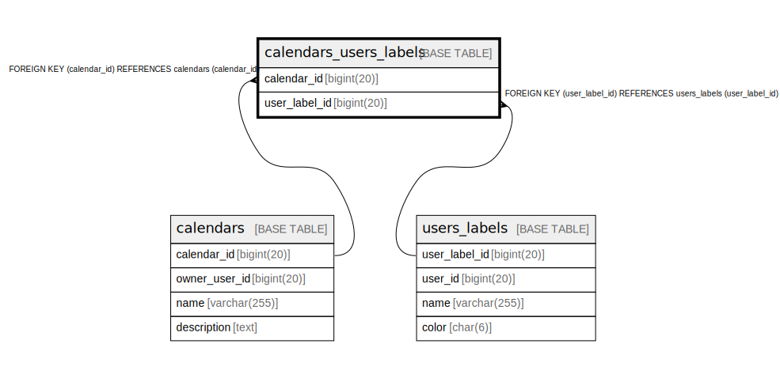

# calendars_users_labels

## Description

<details>
<summary><strong>Table Definition</strong></summary>

```sql
CREATE TABLE `calendars_users_labels` (
  `calendar_id` bigint(20) NOT NULL,
  `user_label_id` bigint(20) NOT NULL,
  PRIMARY KEY (`calendar_id`,`user_label_id`),
  KEY `fk_calendars_users_labels_user_label_id` (`user_label_id`),
  CONSTRAINT `fk_calendars_users_labels_calendar_id` FOREIGN KEY (`calendar_id`) REFERENCES `calendars` (`calendar_id`) ON DELETE CASCADE,
  CONSTRAINT `fk_calendars_users_labels_user_label_id` FOREIGN KEY (`user_label_id`) REFERENCES `users_labels` (`user_label_id`) ON DELETE CASCADE
) ENGINE=InnoDB DEFAULT CHARSET=utf8mb4 COLLATE=utf8mb4_unicode_ci
```

</details>

## Columns

| Name | Type | Default | Nullable | Children | Parents | Comment |
| ---- | ---- | ------- | -------- | -------- | ------- | ------- |
| calendar_id | bigint(20) |  | false |  | [calendars](calendars.md) |  |
| user_label_id | bigint(20) |  | false |  | [users_labels](users_labels.md) |  |

## Constraints

| Name | Type | Definition |
| ---- | ---- | ---------- |
| fk_calendars_users_labels_calendar_id | FOREIGN KEY | FOREIGN KEY (calendar_id) REFERENCES calendars (calendar_id) |
| fk_calendars_users_labels_user_label_id | FOREIGN KEY | FOREIGN KEY (user_label_id) REFERENCES users_labels (user_label_id) |
| PRIMARY | PRIMARY KEY | PRIMARY KEY (calendar_id, user_label_id) |

## Indexes

| Name | Definition |
| ---- | ---------- |
| fk_calendars_users_labels_user_label_id | KEY fk_calendars_users_labels_user_label_id (user_label_id) USING BTREE |
| PRIMARY | PRIMARY KEY (calendar_id, user_label_id) USING BTREE |

## Relations



---

> Generated by [tbls](https://github.com/k1LoW/tbls)
