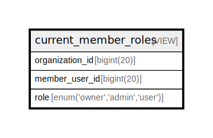

# current_member_roles

## Description

VIEW

<details>
<summary><strong>Table Definition</strong></summary>

```sql
CREATE VIEW current_member_roles AS (select `mrh`.`organization_id` AS `organization_id`,`mrh`.`member_user_id` AS `member_user_id`,`mrh`.`role` AS `role` from (`s25101270_countmein`.`member_roles_history` `mrh` join `s25101270_countmein`.`current_memberships` `cm` on(`mrh`.`organization_id` = `cm`.`organization_id` and `mrh`.`member_user_id` = `cm`.`member_user_id`)) where `mrh`.`created_at` = (select max(`mrh2`.`created_at`) from `s25101270_countmein`.`member_roles_history` `mrh2` where `mrh`.`organization_id` = `mrh2`.`organization_id` and `mrh`.`member_user_id` = `mrh2`.`member_user_id`))
```

</details>

## Columns

| Name | Type | Default | Nullable | Children | Parents | Comment |
| ---- | ---- | ------- | -------- | -------- | ------- | ------- |
| organization_id | bigint(20) |  | false |  |  |  |
| member_user_id | bigint(20) |  | false |  |  |  |
| role | enum('owner','admin','user') |  | false |  |  |  |

## Referenced Tables

| Name | Columns | Comment | Type |
| ---- | ------- | ------- | ---- |
| [member_roles_history](member_roles_history.md) | 6 |  | BASE TABLE |
| [current_memberships](current_memberships.md) | 2 | VIEW | VIEW |

## Relations



---

> Generated by [tbls](https://github.com/k1LoW/tbls)
