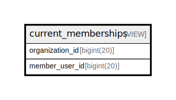

# current_memberships

## Description

VIEW

<details>
<summary><strong>Table Definition</strong></summary>

```sql
CREATE VIEW current_memberships AS (select `omh`.`organization_id` AS `organization_id`,`omh`.`member_user_id` AS `member_user_id` from `s25101270_countmein`.`organization_members_history` `omh` where `omh`.`added` = 1 and `omh`.`created_at` = (select max(`omh2`.`created_at`) from `s25101270_countmein`.`organization_members_history` `omh2` where `omh`.`organization_id` = `omh2`.`organization_id` and `omh`.`member_user_id` = `omh2`.`member_user_id`))
```

</details>

## Columns

| Name | Type | Default | Nullable | Children | Parents | Comment |
| ---- | ---- | ------- | -------- | -------- | ------- | ------- |
| organization_id | bigint(20) |  | false |  |  |  |
| member_user_id | bigint(20) |  | false |  |  |  |

## Referenced Tables

| Name | Columns | Comment | Type |
| ---- | ------- | ------- | ---- |
| [organization_members_history](organization_members_history.md) | 5 |  | BASE TABLE |

## Relations



---

> Generated by [tbls](https://github.com/k1LoW/tbls)
