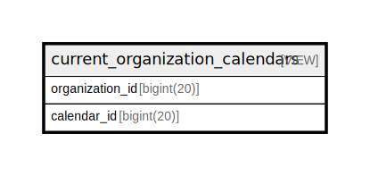

# current_organization_calendars

## Description

VIEW

<details>
<summary><strong>Table Definition</strong></summary>

```sql
CREATE VIEW current_organization_calendars AS (select `och`.`organization_id` AS `organization_id`,`och`.`calendar_id` AS `calendar_id` from `s25101270_countmein`.`organization_calendars_history` `och` where `och`.`added` = 1 and `och`.`created_at` = (select max(`och2`.`created_at`) from `s25101270_countmein`.`organization_calendars_history` `och2` where `och`.`organization_id` = `och2`.`organization_id` and `och`.`calendar_id` = `och2`.`calendar_id`))
```

</details>

## Columns

| Name | Type | Default | Nullable | Children | Parents | Comment |
| ---- | ---- | ------- | -------- | -------- | ------- | ------- |
| organization_id | bigint(20) |  | false |  |  |  |
| calendar_id | bigint(20) |  | false |  |  |  |

## Referenced Tables

| Name | Columns | Comment | Type |
| ---- | ------- | ------- | ---- |
| [organization_calendars_history](organization_calendars_history.md) | 6 |  | BASE TABLE |

## Relations



---

> Generated by [tbls](https://github.com/k1LoW/tbls)
