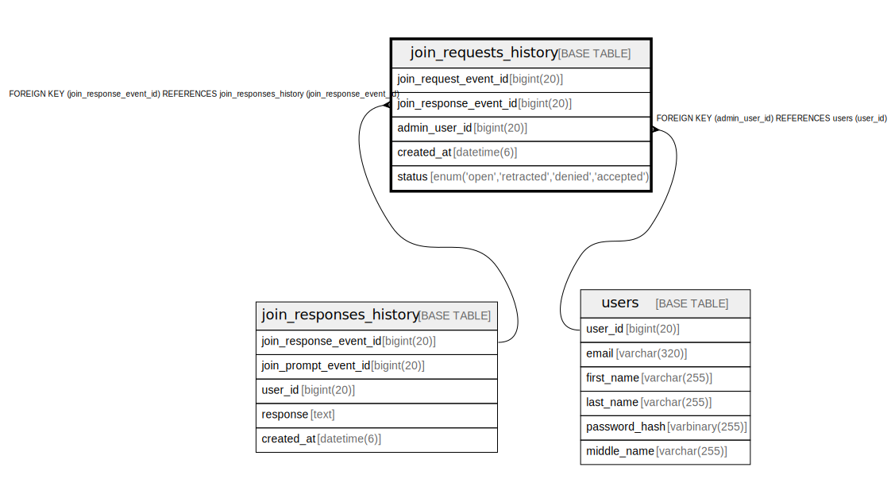

# join_requests_history

## Description

<details>
<summary><strong>Table Definition</strong></summary>

```sql
CREATE TABLE `join_requests_history` (
  `join_request_event_id` bigint(20) NOT NULL AUTO_INCREMENT,
  `join_response_event_id` bigint(20) NOT NULL,
  `admin_user_id` bigint(20) DEFAULT NULL,
  `created_at` datetime(6) NOT NULL,
  `status` enum('open','retracted','denied','accepted') NOT NULL,
  PRIMARY KEY (`join_request_event_id`),
  KEY `fk_join_requests_history_admin_user_id` (`admin_user_id`),
  KEY `fk_join_requests_history_join_response_event_id` (`join_response_event_id`),
  CONSTRAINT `fk_join_requests_history_admin_user_id` FOREIGN KEY (`admin_user_id`) REFERENCES `users` (`user_id`) ON DELETE SET NULL,
  CONSTRAINT `fk_join_requests_history_join_response_event_id` FOREIGN KEY (`join_response_event_id`) REFERENCES `join_responses_history` (`join_response_event_id`) ON DELETE CASCADE
) ENGINE=InnoDB DEFAULT CHARSET=utf8mb4 COLLATE=utf8mb4_unicode_ci
```

</details>

## Columns

| Name | Type | Default | Nullable | Extra Definition | Children | Parents | Comment |
| ---- | ---- | ------- | -------- | ---------------- | -------- | ------- | ------- |
| join_request_event_id | bigint(20) |  | false | auto_increment |  |  |  |
| join_response_event_id | bigint(20) |  | false |  |  | [join_responses_history](join_responses_history.md) |  |
| admin_user_id | bigint(20) | NULL | true |  |  | [users](users.md) |  |
| created_at | datetime(6) |  | false |  |  |  |  |
| status | enum('open','retracted','denied','accepted') |  | false |  |  |  |  |

## Constraints

| Name | Type | Definition |
| ---- | ---- | ---------- |
| fk_join_requests_history_admin_user_id | FOREIGN KEY | FOREIGN KEY (admin_user_id) REFERENCES users (user_id) |
| fk_join_requests_history_join_response_event_id | FOREIGN KEY | FOREIGN KEY (join_response_event_id) REFERENCES join_responses_history (join_response_event_id) |
| PRIMARY | PRIMARY KEY | PRIMARY KEY (join_request_event_id) |

## Indexes

| Name | Definition |
| ---- | ---------- |
| fk_join_requests_history_admin_user_id | KEY fk_join_requests_history_admin_user_id (admin_user_id) USING BTREE |
| fk_join_requests_history_join_response_event_id | KEY fk_join_requests_history_join_response_event_id (join_response_event_id) USING BTREE |
| PRIMARY | PRIMARY KEY (join_request_event_id) USING BTREE |

## Relations



---

> Generated by [tbls](https://github.com/k1LoW/tbls)
