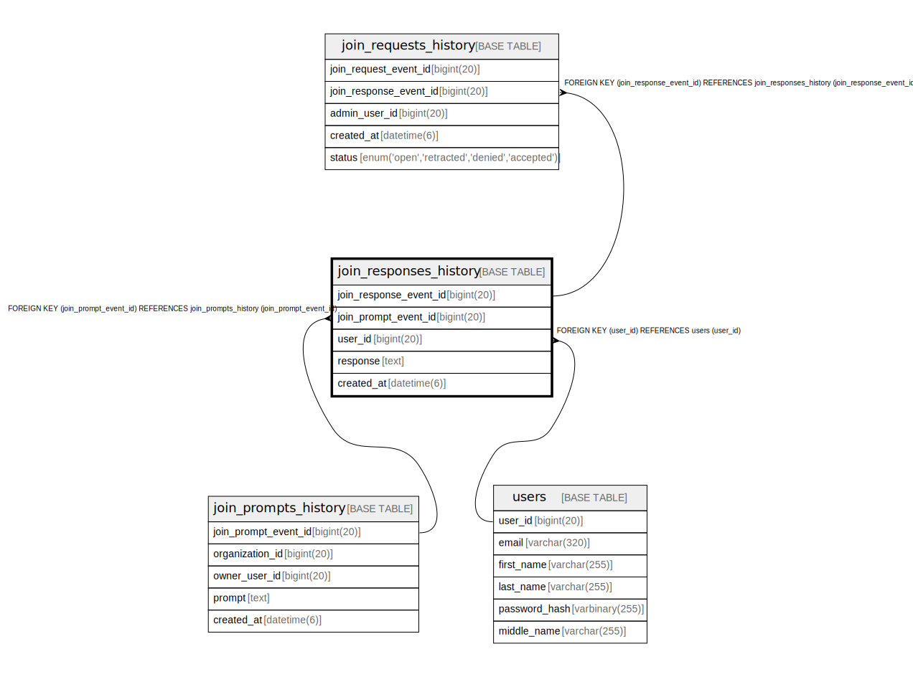

# join_responses_history

## Description

<details>
<summary><strong>Table Definition</strong></summary>

```sql
CREATE TABLE `join_responses_history` (
  `join_response_event_id` bigint(20) NOT NULL AUTO_INCREMENT,
  `join_prompt_event_id` bigint(20) NOT NULL,
  `user_id` bigint(20) NOT NULL,
  `response` text NOT NULL,
  `created_at` datetime(6) NOT NULL,
  PRIMARY KEY (`join_response_event_id`),
  KEY `fk_join_responses_history_join_prompt_event_id` (`join_prompt_event_id`),
  KEY `fk_join_responses_history_user_id` (`user_id`),
  CONSTRAINT `fk_join_responses_history_join_prompt_event_id` FOREIGN KEY (`join_prompt_event_id`) REFERENCES `join_prompts_history` (`join_prompt_event_id`) ON DELETE CASCADE,
  CONSTRAINT `fk_join_responses_history_user_id` FOREIGN KEY (`user_id`) REFERENCES `users` (`user_id`) ON DELETE CASCADE
) ENGINE=InnoDB DEFAULT CHARSET=utf8mb4 COLLATE=utf8mb4_unicode_ci
```

</details>

## Columns

| Name | Type | Default | Nullable | Extra Definition | Children | Parents | Comment |
| ---- | ---- | ------- | -------- | ---------------- | -------- | ------- | ------- |
| join_response_event_id | bigint(20) |  | false | auto_increment | [join_requests_history](join_requests_history.md) |  |  |
| join_prompt_event_id | bigint(20) |  | false |  |  | [join_prompts_history](join_prompts_history.md) |  |
| user_id | bigint(20) |  | false |  |  | [users](users.md) |  |
| response | text |  | false |  |  |  |  |
| created_at | datetime(6) |  | false |  |  |  |  |

## Constraints

| Name | Type | Definition |
| ---- | ---- | ---------- |
| fk_join_responses_history_join_prompt_event_id | FOREIGN KEY | FOREIGN KEY (join_prompt_event_id) REFERENCES join_prompts_history (join_prompt_event_id) |
| fk_join_responses_history_user_id | FOREIGN KEY | FOREIGN KEY (user_id) REFERENCES users (user_id) |
| PRIMARY | PRIMARY KEY | PRIMARY KEY (join_response_event_id) |

## Indexes

| Name | Definition |
| ---- | ---------- |
| fk_join_responses_history_join_prompt_event_id | KEY fk_join_responses_history_join_prompt_event_id (join_prompt_event_id) USING BTREE |
| fk_join_responses_history_user_id | KEY fk_join_responses_history_user_id (user_id) USING BTREE |
| PRIMARY | PRIMARY KEY (join_response_event_id) USING BTREE |

## Relations



---

> Generated by [tbls](https://github.com/k1LoW/tbls)
