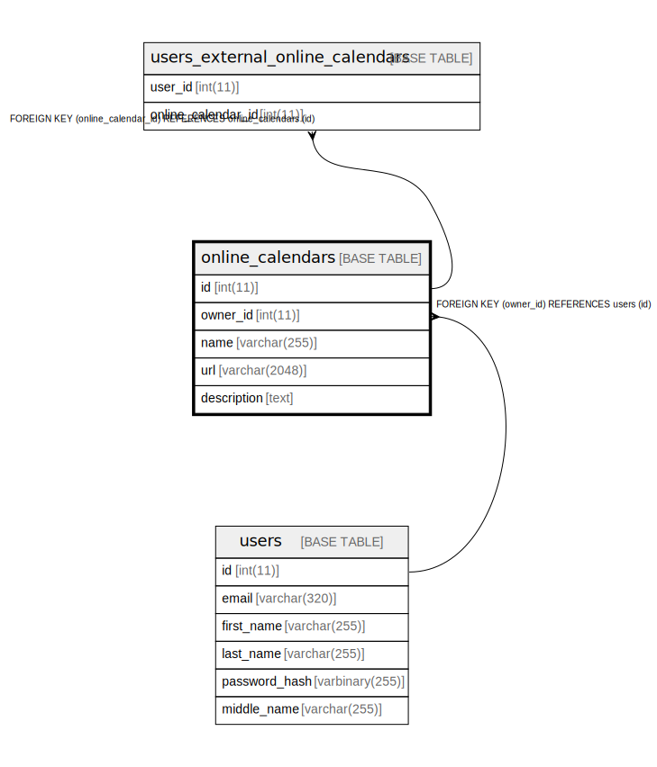

# online_calendars

## Description

<details>
<summary><strong>Table Definition</strong></summary>

```sql
CREATE TABLE `online_calendars` (
  `id` int(11) NOT NULL AUTO_INCREMENT,
  `owner_id` int(11) NOT NULL,
  `name` varchar(255) NOT NULL,
  `url` varchar(2048) NOT NULL,
  `description` text DEFAULT NULL,
  PRIMARY KEY (`id`),
  KEY `fk_online_calendars_owner_id` (`owner_id`),
  CONSTRAINT `fk_online_calendars_owner_id` FOREIGN KEY (`owner_id`) REFERENCES `users` (`id`) ON DELETE CASCADE
) ENGINE=InnoDB DEFAULT CHARSET=utf8mb4 COLLATE=utf8mb4_unicode_ci
```

</details>

## Columns

| Name | Type | Default | Nullable | Extra Definition | Children | Parents | Comment |
| ---- | ---- | ------- | -------- | ---------------- | -------- | ------- | ------- |
| id | int(11) |  | false | auto_increment | [users_external_online_calendars](users_external_online_calendars.md) |  |  |
| owner_id | int(11) |  | false |  |  | [users](users.md) |  |
| name | varchar(255) |  | false |  |  |  |  |
| url | varchar(2048) |  | false |  |  |  |  |
| description | text | NULL | true |  |  |  |  |

## Constraints

| Name | Type | Definition |
| ---- | ---- | ---------- |
| fk_online_calendars_owner_id | FOREIGN KEY | FOREIGN KEY (owner_id) REFERENCES users (id) |
| PRIMARY | PRIMARY KEY | PRIMARY KEY (id) |

## Indexes

| Name | Definition |
| ---- | ---------- |
| fk_online_calendars_owner_id | KEY fk_online_calendars_owner_id (owner_id) USING BTREE |
| PRIMARY | PRIMARY KEY (id) USING BTREE |

## Relations



---

> Generated by [tbls](https://github.com/k1LoW/tbls)
