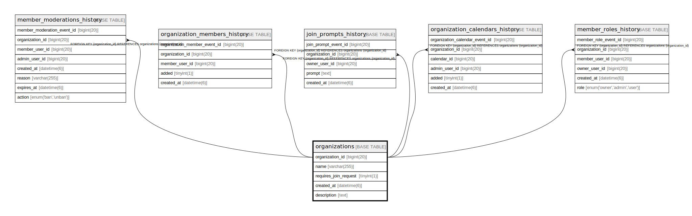

# organizations

## Description

<details>
<summary><strong>Table Definition</strong></summary>

```sql
CREATE TABLE `organizations` (
  `organization_id` bigint(20) NOT NULL AUTO_INCREMENT,
  `name` varchar(255) NOT NULL,
  `requires_join_request` tinyint(1) NOT NULL,
  `created_at` datetime(6) NOT NULL,
  `description` text DEFAULT NULL,
  PRIMARY KEY (`organization_id`)
) ENGINE=InnoDB DEFAULT CHARSET=utf8mb4 COLLATE=utf8mb4_unicode_ci
```

</details>

## Columns

| Name | Type | Default | Nullable | Extra Definition | Children | Parents | Comment |
| ---- | ---- | ------- | -------- | ---------------- | -------- | ------- | ------- |
| organization_id | bigint(20) |  | false | auto_increment | [member_moderations_history](member_moderations_history.md) [organization_members_history](organization_members_history.md) [join_prompts_history](join_prompts_history.md) [organization_calendars_history](organization_calendars_history.md) [member_roles_history](member_roles_history.md) |  |  |
| name | varchar(255) |  | false |  |  |  |  |
| requires_join_request | tinyint(1) |  | false |  |  |  |  |
| created_at | datetime(6) |  | false |  |  |  |  |
| description | text | NULL | true |  |  |  |  |

## Constraints

| Name | Type | Definition |
| ---- | ---- | ---------- |
| PRIMARY | PRIMARY KEY | PRIMARY KEY (organization_id) |

## Indexes

| Name | Definition |
| ---- | ---------- |
| PRIMARY | PRIMARY KEY (organization_id) USING BTREE |

## Relations



---

> Generated by [tbls](https://github.com/k1LoW/tbls)
