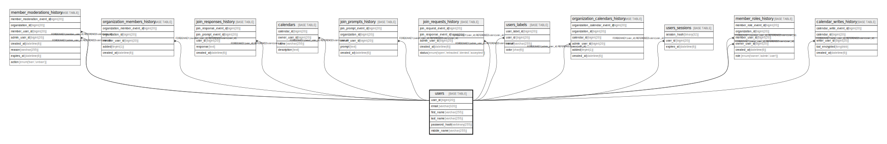

# users

## Description

<details>
<summary><strong>Table Definition</strong></summary>

```sql
CREATE TABLE `users` (
  `id` int(11) NOT NULL AUTO_INCREMENT,
  `email` varchar(320) NOT NULL,
  `first_name` varchar(255) NOT NULL,
  `last_name` varchar(255) NOT NULL,
  `password_hash` varbinary(255) NOT NULL,
  `middle_name` varchar(255) DEFAULT NULL,
  PRIMARY KEY (`id`),
  UNIQUE KEY `uq_users_email` (`email`)
) ENGINE=InnoDB AUTO_INCREMENT=[Redacted by tbls] DEFAULT CHARSET=utf8mb4 COLLATE=utf8mb4_unicode_ci
```

</details>

## Columns

| Name | Type | Default | Nullable | Extra Definition | Children | Parents | Comment |
| ---- | ---- | ------- | -------- | ---------------- | -------- | ------- | ------- |
| id | int(11) |  | false | auto_increment | [users_calendars](users_calendars.md) [calendars](calendars.md) [users_sessions](users_sessions.md) |  |  |
| email | varchar(320) |  | false |  |  |  |  |
| first_name | varchar(255) |  | false |  |  |  |  |
| last_name | varchar(255) |  | false |  |  |  |  |
| password_hash | varbinary(255) |  | false |  |  |  |  |
| middle_name | varchar(255) | NULL | true |  |  |  |  |

## Constraints

| Name | Type | Definition |
| ---- | ---- | ---------- |
| PRIMARY | PRIMARY KEY | PRIMARY KEY (id) |
| uq_users_email | UNIQUE | UNIQUE KEY uq_users_email (email) |

## Indexes

| Name | Definition |
| ---- | ---------- |
| PRIMARY | PRIMARY KEY (id) USING BTREE |
| uq_users_email | UNIQUE KEY uq_users_email (email) USING BTREE |

## Relations



---

> Generated by [tbls](https://github.com/k1LoW/tbls)
